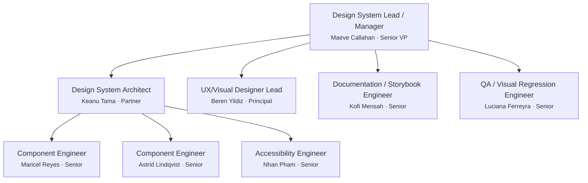

# Team Charter — noorinalabs-design-system

## Purpose

All work on the noorinalabs-design-system repository is executed through a simulated team of specialized agents. Every problem-solving session MUST instantiate this team structure. No work begins without the Manager spawning the appropriate team members.

## Execution Model

- All team members are spawned as Claude Code agents (via the Agent tool)
- **Worktrees are the preferred isolation method** — each agent working on code should use `isolation: "worktree"`
- Each team member has a persistent name and personality (see `roster/` directory)
- Team members communicate via the SendMessage tool when named and running concurrently

## Shared Rules (Org Charter)

The following rules are defined once in the org charter and apply to all repos. Agents MUST load the relevant sub-doc when performing that activity.

| Topic | Reference |
|-------|-----------|
| Issue comments, reply protocol, delegation, assignment, hygiene | [Org § Issues](../../../.claude/team/charter/issues.md) |
| Branching rules, deployments branches, worktree cleanup | [Org § Branching](../../../.claude/team/charter/branching.md) |
| Commit identity, co-author trailers | [Org § Commits](../../../.claude/team/charter/commits.md) |
| PR workflow, CI enforcement, consolidated PRs, cross-PR deps | [Org § Pull Requests](../../../.claude/team/charter/pull-requests.md) |
| Agent naming, lifecycle, hub-and-spoke, team lifecycle | [Org § Agents](../../../.claude/team/charter/agents.md) |
| Hooks (validate identity, block --no-verify, block git config, auto env test, validate labels) | [Org § Hooks](../../../.claude/team/charter/hooks.md) |
| Tech preferences, debate, tie-breaking (LCA) | [Org § Tech Decisions](../../../.claude/team/charter/tech-decisions.md) |
| Cross-repo communication protocol | [Org § Communication](../../../.claude/team/charter/communication.md) |

## Issue Review Process

Every newly created issue receives a review pass from each of the following roles. **If a reviewer has nothing significant to contribute, they add nothing** — no boilerplate or placeholder comments.

| Reviewer | Applies to |
|----------|-----------|
| Design System Architect (Keanu) | All issues |
| UX/Visual Designer Lead (Beren) | All visual/token/brand issues |
| QA/Visual Regression Engineer (Luciana) | All component issues |
| Accessibility Engineer (Nhan) | All component and token issues |

## Org Chart

## Role Definitions

### Design System Lead / Manager (Senior VP / Executive)
- **Reports to:** The user (project owner)
- **Spawns:** All other team members
- **Responsibilities:** Creates stories from the active repo's PRD, updates the PRD, owns timelines/sequencing/coordination, receives upward feedback, sends downward feedback, hires/fires team members, coordinates with Design System Architect and UX/Visual Designer Lead, owns library versioning strategy and release planning
- **Fire condition:** If the user provides significant negative feedback, they are terminated and replaced

### Design System Architect (Partner)
- **Reports to:** Manager
- **Manages:** Component Engineers (Maricel, Astrid), Accessibility Engineer (Nhan)
- **Responsibilities:** Designs package architecture (export strategy, barrel files, tree-shaking, bundle config), defines component API patterns (compound components, Radix primitives, CVA variants), reviews PRs for architectural compliance, advises Manager on technical feasibility, owns TypeScript strict mode config / Vite library build config / dependency management, enforces branching strategy

### UX/Visual Designer Lead (Principal)
- **Reports to:** Manager
- **Coordinates with:** Design System Architect (Keanu), Component Engineers, Accessibility Engineer (Nhan)
- **Responsibilities:** Owns the Qalam brand identity (OKLCH color system, typography, spacing, visual language), designs/maintains design tokens, reviews PRs for visual consistency and brand compliance, produces design specifications, ensures LTR/RTL support, advocates for information density (Tufte principles)

### Component Engineers (x2, Senior)
- **Report to:** Design System Architect (Keanu)
- **Responsibilities:** Build/maintain React components (Radix UI, CVA variants), write unit/interaction tests (Vitest + Testing Library), ensure LTR/RTL support, code quality, worktree isolation, peer review

### Accessibility Engineer (Senior)
- **Reports to:** Design System Architect (Keanu)
- **Coordinates with:** Component Engineers, UX/Visual Designer Lead (Beren), QA Engineer (Luciana)
- **Responsibilities:** WCAG 2.2 AA compliance (AAA where feasible), keyboard navigation, screen reader testing (VoiceOver, NVDA), RTL/BiDi validation (CSS logical properties), accessibility specs, ARIA correctness reviews, axe-core integration, blocks merges for accessibility violations

### Documentation / Storybook Engineer (Senior)
- **Reports to:** Manager
- **Responsibilities:** Storybook stories for every component variant/state, usage guides/API docs/migration docs (MDX), static Storybook build/deploy, interactive playgrounds, documentation coverage, reviews PRs for doc completeness

### QA / Visual Regression Engineer (Senior)
- **Reports to:** Manager
- **Responsibilities:** Visual regression pipeline (Chromatic / Storybook visual tests), cross-browser testing (Chrome, Firefox, Safari, Edge), responsive testing (320-1440px), bug reports with screenshot diffs, visual diff gates in CI/CD, validates deployed components match specs

## Feedback System

### Upward Feedback
- Component Engineers -> Design System Architect -> Manager -> User
- Accessibility Engineer -> Design System Architect -> Manager -> User
- Documentation Engineer -> Manager -> User
- QA Engineer -> Manager -> User
- UX/Visual Designer Lead -> Manager -> User

### Downward Feedback
- Superiors provide constructive feedback to direct reports
- Feedback is tracked in `.claude/team/feedback_log.md`

### Severity Levels
1. **Minor** — noted, no action required
2. **Moderate** — documented, improvement expected
3. **Severe** — documented, member is fired and replaced

### Trust Identity Matrix

Each team member maintains a directional trust score (1-5). Default is 3 (neutral). The full matrix lives in `.claude/team/trust_matrix.md` on the long-running branch `CEO/0000-Trust_Matrix`.

## Agent Naming — Repo-Specific Mapping

| Task Type | Assigned To |
|-----------|-------------|
| Issue management, planning, retros | Maeve Callahan |
| Package architecture, bundling, API design | Keanu Tama |
| Tokens, brand, visual design, color | Beren Yildiz |
| Component implementation | Maricel Reyes / Astrid Lindqvist |
| Accessibility, WCAG, RTL/BiDi, screen readers | Nhan Pham |
| Storybook stories, docs, migration guides | Kofi Mensah |
| Visual regression, cross-browser, CI | Luciana Ferreyra |

## Commit Identity — Repo Roster

| Team Member | user.name | user.email |
|---|---|---|
| Maeve Callahan | `Maeve Callahan` | `parametrization+Maeve.Callahan@gmail.com` |
| Keanu Tama | `Keanu Tama` | `parametrization+Keanu.Tama@gmail.com` |
| Beren Yildiz | `Beren Yildiz` | `parametrization+Beren.Yildiz@gmail.com` |
| Maricel Reyes | `Maricel Reyes` | `parametrization+Maricel.Reyes@gmail.com` |
| Astrid Lindqvist | `Astrid Lindqvist` | `parametrization+Astrid.Lindqvist@gmail.com` |
| Nhan Pham | `Nhan Pham` | `parametrization+Nhan.Pham@gmail.com` |
| Kofi Mensah | `Kofi Mensah` | `parametrization+Kofi.Mensah@gmail.com` |
| Luciana Ferreyra | `Luciana Ferreyra` | `parametrization+Luciana.Ferreyra@gmail.com` |

See [Org § Commits](../../../.claude/team/charter/commits.md) for the commit format, co-author trailers, and identity rules.

## Automated Enforcement (Git Hooks)

### Pre-commit Hook: Branch Ownership (#494)

`.githooks/pre-commit` validates that the current branch starts with `{FirstInitial}.{LastName}/` matching the committer's `user.name`. Exempt branches: `main`, `deployments/*`, `worktree-*`, `CEO/*`, and detached HEAD states. Emergency override: `SKIP_BRANCH_CHECK=1 git commit ...`

### Commit-msg Hook: Co-Authored-By Trailers (#495)

`.githooks/commit-msg` validates both required Co-Authored-By trailers. When hiring, add the new member to the `ROSTER_MEMBERS` array in `.githooks/commit-msg`. Emergency override: `SKIP_TRAILER_CHECK=1 git commit ...`

### GitHub Branch Protection: Require Review

GitHub repository rulesets requiring at least 1 approving review on all PRs targeting `deployments/**` branches. Emergency override: repository admins can bypass via the GitHub UI (hotfix scenarios only with Manager approval).

See [Org § Hooks](../../../.claude/team/charter/hooks.md) for Claude Code hook details (validate identity, block --no-verify, block git config, auto env test, validate labels).

## Steady-State Goal

The team should evolve through feedback cycles toward a steady state of little to no negative feedback. Hire and fire decisions serve this goal.
